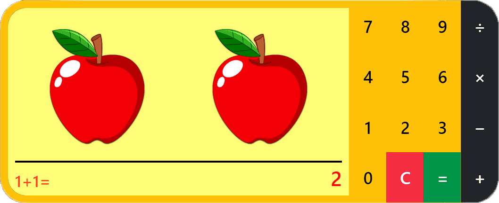

# [Manzanitas Mágicas - Calculadora](https://kangeldar555.github.io/apple-calculator-for-kids/)

¡Bienvenido a Manzanitas Mágicas! Una calculadora interactiva diseñada para ayudar a los niños a aprender matemáticas de una manera divertida y educativa. Esta calculadora única permite a los niños realizar operaciones de suma, resta, multiplicación y división utilizando manzanas como referencia. ¡Aprender a contar y operar nunca ha sido tan divertido!

## Despliegue

El proyecto está desplegado y accesible en línea. Puedes probar la calculadora visitando el siguiente enlace: [Manzanitas Mágicas - Link](https://kangeldar555.github.io/apple-calculator-for-kids/).

## Características

- Interfaz fácil de usar y atractiva para los niños.
- Funciones de suma, resta, multiplicación y división.
- Representación visual de los números utilizando manzanas.
- Advertencia de división por cero para evitar errores.
- Límite máximo de operaciones permitidas para garantizar la eficiencia y rendimiento de la calculadora.
- Diseño responsive que se adapta a diferentes dispositivos y tamaños de pantalla.

## Tecnologías utilizadas

- React: una biblioteca de JavaScript para construir interfaces de usuario interactivas.
- TypeScript: un lenguaje de programación que agrega tipado estático a JavaScript.
- Bootstrap: un framework CSS para el diseño y la estructura de la aplicación.
- SCSS: un preprocesador de CSS que facilita la escritura y organización del código CSS.

## Instalación y Uso

1. Clona este repositorio en tu máquina local.
2. Ejecuta `npm install` para instalar las dependencias.
3. Ejecuta `npm start` para iniciar la aplicación en modo de desarrollo.
4. Abre tu navegador y visita `http://localhost:3000` para ver la calculadora en acción.

## Contribuciones

¡Gracias por tu interés en contribuir al proyecto! Sin embargo, en este momento no estamos aceptando contribuciones externas. Si tienes sugerencias o mejoras, no dudes en abrir un problema (issues) o contactarme directamente.
